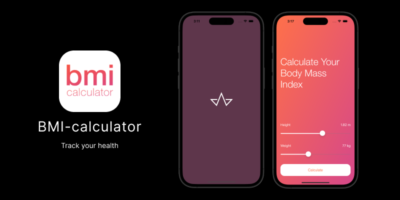

# BMI Calculator

A Body Mass Index calculator based on the user’s weight and height it will calculate their body mass and give a piece of health advice depending on whether if they have eaten too many pies or if they need to eat more pies. 

>The project was created using tutorials from Udemy course by Angela Yu, The App Brewery's Complete App Development Bootcamp
